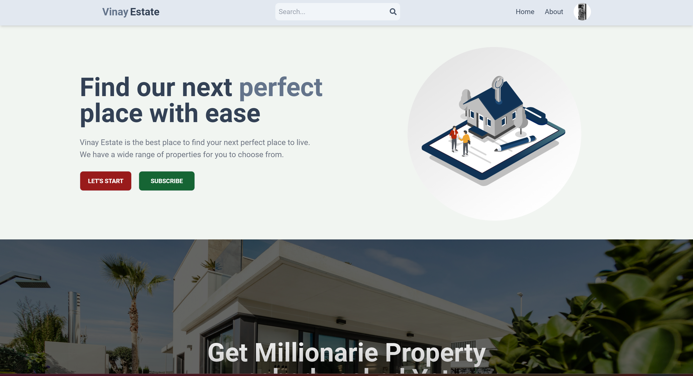
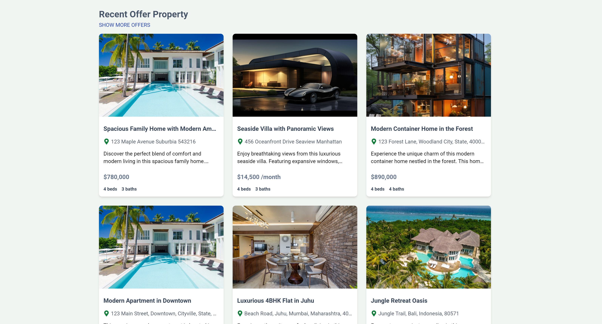
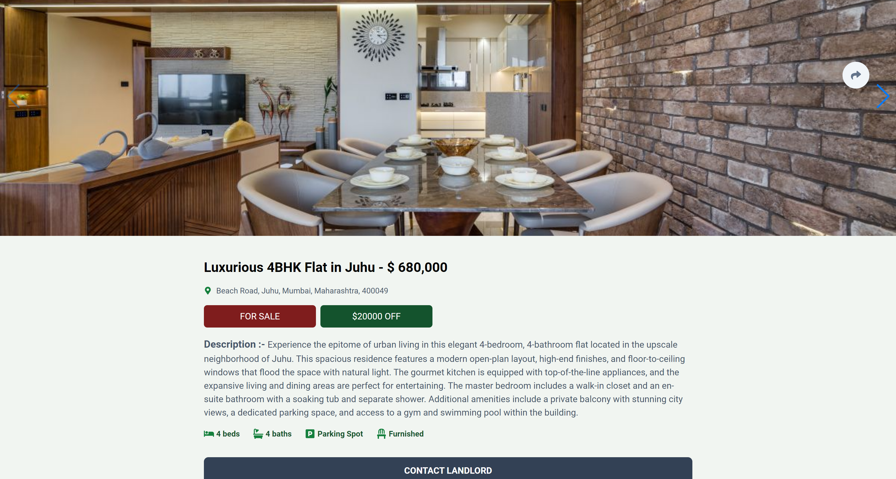

# Real Estate App







## <span style="color: blue;">Live Site</span>

[Visit the live real estate app](https://real-estate-app-mpmk.onrender.com)

## Overview

Welcome to my real estate app! This application provides a comprehensive platform for users to browse, search, and list properties in New York. It is built using the MERN stack (MongoDB, Express, React, Node.js) and features real-time updates and an intuitive user interface.

## Features

- **Property Listings:** Browse and search for properties with detailed descriptions and images.
- **User Authentication:** Secure login and registration system.
- **User Dashboard:** Manage your listings, view favorites, and update your profile.
- **Real-time Updates:** Get the latest property information instantly.
- **Responsive Design:** Optimized for both desktop and mobile devices.

## Technologies Used

- **Frontend:** React.js, Tailwind CSS
- **Backend:** Node.js, Express.js
- **Database:** MongoDB
- **State Management:** Redux Toolkit
- **Other:** Vite

## Installation

To run this real estate application locally, follow these steps:

1. **Clone the repository:**
   ```bash
   git clone https://github.com/thorreactdev/real-estate-app.git
